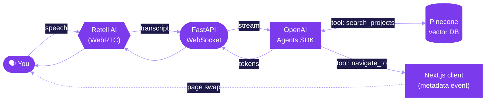

<!--
  art3m1s.me — Voice-driven AI Portfolio
  Author: Bill Zhang (@IdkwhatImD0ing)
-->

<a id="top"></a>

<p align="center">
  
</p>

<p align="center">
  <a href="https://art3m1s.me">
    
  </a>
</p>

<p align="center">
  <a href="https://art3m1s.me"></a>
  <a href="https://github.com/IdkwhatImD0ing/PortfolioV4/actions"></a>
  <a href="https://github.com/IdkwhatImD0ing/PortfolioV4/stargazers"></a>
  <a href="https://github.com/IdkwhatImD0ing/PortfolioV4/blob/main/LICENSE"></a>
  
</p>

<p align="center">
  <a href="https://art3m1s.me"></a>
</p>

---

## TL;DR

> **`art3m1s.me`** is a portfolio you don't *read* — you **talk to it**.
> Click "Start Voice", and a Retell-powered agent listens, semantic-searches my projects in Pinecone, and **navigates the page for you in real time** while it answers.

<table>
<tr>
<td>



</td>
<td>

### What it does
- 🎙️  **Talk** to my portfolio in natural language
- 🧭  Agent **navigates the site** for you (`navigate_to` tool)
- 🔎  **Semantic search** over every project (Pinecone)
- 🛡️  Prompt-injection **guardrails** on the LLM tier
- ⚡  **Streaming** end-to-end — voice in → voice out
- 🌗  Dark-mode-first UI w/ Tailwind v4

</td>
</tr>
</table>

---

## ✨ Tech Stack

<p align="center">
  <a href="https://skillicons.dev">
    
  </a>
</p>

<details>
<summary><b>Full breakdown</b> · click to expand</summary>

| Layer | Tech | Why |
|---|---|---|
| **Frontend** | Next.js 15 (App Router) · React 19 · TypeScript 5 · Tailwind v4 · Retell SDK | Fast, modern, theme-able, voice-ready |
| **Backend** | FastAPI · Uvicorn · OpenAI Agents SDK · Retell SDK 4.4 · Pydantic | Streaming WebSocket + tool-calling agent |
| **Vector DB** | Pinecone 7 · `text-embedding-3-large` | Semantic search across projects |
| **Infra** | Docker · Cloud Run · Vercel · ngrok (dev) | One-command deploys, edge-friendly |
| **Observability** | Vercel Analytics · Speed Insights · structured logs | Real-user perf + traces |

</details>

---

## 🚀 Quickstart

```bash
git clone https://github.com/IdkwhatImD0ing/PortfolioV4.git
cd PortfolioV4
make install-deps        # uv + pnpm + ngrok

# In one shot — opens server, client, and ngrok in 3 tabs
make tabs
```

<details>
<summary><b>Manual mode</b></summary>

```bash
cd server && uv run uvicorn main:app --reload          # :8000
cd client && pnpm dev                                  # :3000
ngrok http --url=conversational.ngrok.app 8000         # public webhook
```

</details>

### Required env vars

```bash
# server/.env
RETELL_API_KEY=...
OPENAI_API_KEY=...
PINECONE_API_KEY=...

# client/.env.local (see client/.env.local.example for optional dev-agent vars)
RETELLAI_API_KEY=...
NEXT_PUBLIC_RETELL_AGENT_ID=...
NEXT_PUBLIC_APP_URL=http://localhost:3000
```

---

## 📐 Architecture

```text
┌──────────────────────────┐         ┌──────────────────────────┐
│   client/  (Next.js 15)  │  WSS    │  server/  (FastAPI)      │
│   • voice orb (mic)      │ ◀────▶  │  • /webhook (Retell)     │
│   • page.tsx (sections)  │         │  • /ws-* (LLM stream)    │
│   • metadata listener    │         │  • LlmClient + tools     │
└────────────┬─────────────┘         └─────────────┬────────────┘
             │                                     │
             ▼                                     ▼
       Retell WebRTC                        OpenAI Agents SDK
                                                   │
                                                   ▼
                                         Pinecone (project-search)
```

| Module | What lives there |
|---|---|
| [`client/`](./client) | Next.js 15 UI · voice orb · one-page scroll sections · `/api/create-web-call` proxy |
| [`server/`](./server) | FastAPI WebSocket · OpenAI Agents · navigation + search tools · guardrails |
| [`pinecone/`](./pinecone) | One-shot ingestion: `data.json` → embeddings → Pinecone index |
| [`browserless/`](./browserless) | Headless browser sidecar for resume / preview rendering on Cloud Run |

Deeper docs: [`client/docs`](./client/docs) · [`server/docs`](./server/docs) · [`pinecone/docs`](./pinecone/docs)

---

## 🎯 Features that make this not-just-another-portfolio

- **Voice as a first-class router.** The agent emits `navigate_to(page)` tool calls; the client subscribes to Retell metadata events and swaps pages — no buttons required.
- **RAG over me.** Every project + experience is embedded into Pinecone. Ask *"what did you build for emergency dispatch?"* — it pulls **DispatchAI** by meaning, not keywords.
- **Guardrails that actually run.** A small classifier agent checks each user turn for prompt-injection / off-topic before the main LLM sees it.
- **Streaming end-to-end.** Tokens stream from OpenAI → FastAPI → Retell → audio in <600 ms.
- **JSON-LD + `/llms.txt`** so search engines *and* LLMs both index the site cleanly.
- **Edge-grade UX.** Speed Insights, Vercel Analytics, theme-color matched to the dark hero.

---

## 📊 Repo at a glance

<p align="center">
  <a href="https://github.com/IdkwhatImD0ing/PortfolioV4">
    
  </a>
  <a href="https://github.com/IdkwhatImD0ing">
    
  </a>
</p>

<p align="center">
  
</p>

---

## 🌟 Featured projects (pulled into the agent)

<p align="center">
  <a href="https://github.com/IdkwhatImD0ing/DispatchAI">
    
  </a>
  <a href="https://github.com/aurelisajuan/TalkTuahBank">
    
  </a>
  <a href="https://github.com/IdkwhatImD0ing/SlugLoop">
    
  </a>
  <a href="https://github.com/IdkwhatImD0ing/AdaptEd">
    
  </a>
</p>

---

## 🤝 Connect

<p align="center">
  <a href="https://art3m1s.me"></a>
  <a href="https://linkedin.com/in/bill-zhang1"></a>
  <a href="https://github.com/IdkwhatImD0ing"></a>
  <a href="https://devpost.com/IdkwhatImD0ing"></a>
  <a href="mailto:jzhang71@usc.edu"></a>
</p>

---

## ⭐ Star history

<p align="center">
  <a href="https://star-history.com/#IdkwhatImD0ing/PortfolioV4&Date">
    
  </a>
</p>

<p align="center">
  <sub>If this project sparks an idea, drop a ⭐ — it helps a ton.</sub>
</p>

<p align="center">
  <a href="#top">⬆ Back to top</a>
</p>

<p align="center">
  
</p>
